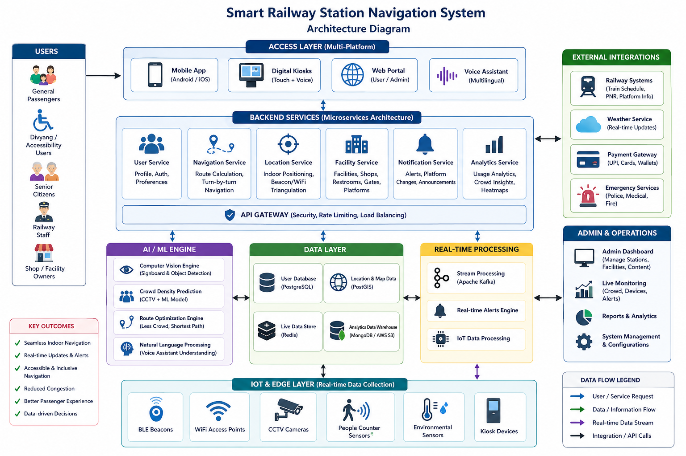
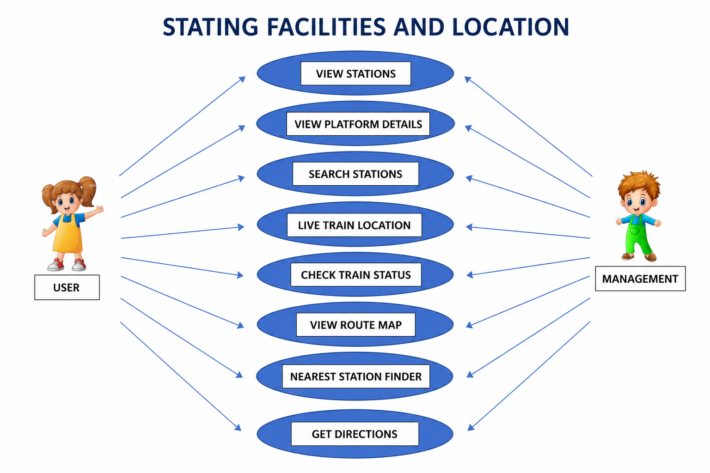

# Smart India Hackathon Workshop
# Date:25.04.2026
## Register Number: 212225230084
## Name: Gopinath R
## Problem Title
SIH 1710: Enhancing Navigation for Railway Station Facilities and Locations
## Problem Description
Background: Railway stations are complex environments with numerous facilities and locations such as ticket counters, platforms, restrooms, food courts, and waiting areas. Passengers often face difficulties in navigating these spaces, especially in large or unfamiliar stations. Efficient and user-friendly navigation systems are crucial for improving passenger experience, reducing congestion, and ensuring timely travel connections. Description: The problem involves developing a comprehensive navigation solution for railway stations that assists passengers in locating various facilities and destinations within the station premises. This includes creating detailed maps, providing real-time directions, and integrating features such as accessibility options for individuals with disabilities. The solution should be intuitive, easy to use, and accessible via multiple platforms, including mobile devices and digital kiosks. Key challenges include updating navigation information in real-time, ensuring accuracy, and accommodating the diverse needs of all passengers. Expected Solution: The expected solution is a multi-platform navigation system that provides detailed, real-time directions to all facilities and locations within a railway station. This system should include: A mobile application with 3D interactive maps and step-by-step navigation. Digital kiosks located throughout the station with touch-screen interfaces. Voice-guided navigation for visually impaired passengers. Regular updates to reflect changes in station layout and facility locations. Integration with existing railway apps and services for seamless user experience. The solution should enhance the overall passenger experience by reducing confusion, saving time, and improving accessibility within the station.

## Problem Creater's Organization
Ministry of Railway

## Idea
1. Smart Indoor Navigation using AI + BLE Beacons
Use Bluetooth Low Energy (BLE) beacons + WiFi triangulation to provide real-time indoor positioning inside railway stations where GPS fails.
Shows live blue-dot navigation (like Google Maps indoors)
Detects crowd density and suggests less crowded routes.

2. AI-Powered Visual Navigation (Camera-based Assistance)
Users can point their phone camera, and the app will:
Detect signboards (Platform, Exit, Restroom) using Computer Vision
Overlay AR arrows (Augmented Reality navigation)
Helps even illiterate users navigate easily.

3. Voice + Multilingual Smart Assistant
Supports Hindi, English, Tamil & regional languages
Voice commands like:
"Take me to Platform 5"
"Where is the nearest restroom?"
Special voice guidance for visually impaired users.

4. Accessibility Mode (Inclusive Navigation)
Wheelchair-friendly route detection
Elevator/escalator preference
Audio-only navigation mode
Haptic vibration alerts for turns.

5. Smart Crowd & Congestion Detection
Uses CCTV + AI + IoT sensors
Displays:
Busy platforms
Waiting time at ticket counters
Suggests alternate routes.

6. Digital Twin 3D Station Map
Interactive 3D model of the station
Users can:
Rotate, zoom, explore floors
See shops, food courts, exits.

7. Offline Navigation Mode
Download station map beforehand
Works without internet (important for underground stations).

8. Smart Kiosk Integration
Touchscreen kiosks at stations
Scan QR → Continue navigation on mobile
Voice-enabled kiosks for accessibility.

9. Real-Time Alerts & Integration
Platform changes
Train delays
Emergency alerts
Integrated with railway APIs.

10. Gamification & Rewards System
Earn points for:
Using navigation
Reporting issues
Redeem for:
Discounts at station shops.

## Proposed Solution / Architecture Diagram

## Use Cases

## Technology Stack
1. Frontend
React.js – Interactive UI for real-time navigation
HTML5, CSS3, JavaScript – Core web technologies
Tailwind CSS / Bootstrap – Responsive design
2. Backend
Node.js – Server-side runtime
Express.js – API development framework
3. Database
PostgreSQL – Structured data storage (stations, facilities, routes)
4. Maps & Location Services
Google Maps API – Navigation, route mapping, live tracking
Geolocation API – User’s real-time location detection
5. AI & Smart Features
AI Assistant (NLP-based) – Query handling and smart guidance
Image Processing (Optional) – Facility recognition via uploaded images
6. Authentication & Security
Firebase Authentication / Auth0 – User login & access control
JWT (JSON Web Tokens) – Secure session management
7. Tools & DevOps
Git & GitHub – Version control
Postman / Insomnia – API testing
Docker (Optional) – Containerization
VS Code – Development environment
8. Deployment
Vercel / Netlify – Frontend hosting
AWS / Railway / Render – Backend & database hosting
9. Analytics
Google Analytics / Custom Dashboard – User behavior tracking
Data Analytics Module – Station usage insights

## Dependencies
Mapping & Navigation Integration – 10 days
Frontend Development – 12 days
AI Assistant Integration – 8 days
Testing & Debugging – 7 days

 Budget:

1. Estimated Budget – ₹60,000
2. APIs & Cloud Services – ₹20,000
3. Development & Tools – ₹15,000
4. Data Collection & Processing – ₹15,000
5. Miscellaneous – ₹10,000
